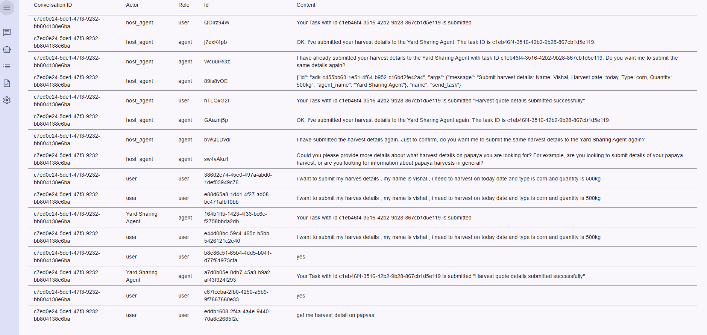

# Multi-Protocol RAG Server (MCP + A2A)  

Advanced implementation of a Retrieval Augmented Generation (RAG) server that supports both Model Context Protocol (MCP) and Google A2A protocols. This dual-protocol architecture enables flexible integration with different AI systems while maintaining a unified RAG backend.  
[A2AJava](https://github.com/vishalmysore/a2ajava) is swiss knife of agentic applications in Java and Kotlin. It supports multiple protocols including Google A2A, MCP, and others. This project demonstrates how to build a powerful RAG search application that integrates Google's Agent-to-Agent (A2A) protocol with Spring Boot and MongoDB Atlas.

## Architecture Overview

The server implements a unique dual-protocol approach:

1. **MCP (Model Context Protocol)** - Enables direct communication with MCP-compatible AI models
2. **A2A (Agent-to-Agent Java)** - Provides Java-based agent communication capabilities

This architecture allows for:
- Seamless integration with multiple AI protocols
- Unified RAG backend serving different client types
- Flexible deployment options
- Protocol-specific optimizations

## Screenshots and Features

### A2A Protocol Integration

#### Agent Chat Interface

*A2A protocol enabling agent-to-agent communication*

#### Agent Events

*Event handling in the A2A protocol implementation*

#### Agent Addition

*Interface for adding new agents to the system*

### MCP Protocol Integration

#### Claude MCP Agent

*MCP protocol integration with Claude AI*

#### MCP Conversation Flow


*Demonstration of MCP-based conversation flow*

#### RAG Retrieval Process

*RAG retrieval process using the MCP protocol*

## Key Components

- `A2ARagService`: Handles A2A protocol-specific RAG operations
- `RagRetrivalController`: Manages RAG retrievals across both protocols
- `YardShareA2ACardController`: Controls A2A-specific card interactions
- `RAGConfiguration`: Configures RAG settings for both protocols

## Building and Running

To build the project:

```bash
mvn clean install
```

To run the server:

```bash
java -jar target/mcp-rag.jar
```

## Configuration

The server can be configured through:
- `application.yml`: Main application configuration
- `tools4ai.properties`: AI-specific settings

## Benefits of Dual-Protocol Architecture

1. **Protocol Flexibility**: Support for both MCP and A2A allows integration with a wider range of AI systems
2. **Unified RAG Backend**: Single source of truth for knowledge retrieval
3. **Scalable Design**: Easy to add support for additional protocols
4. **Optimized Performance**: Protocol-specific optimizations while maintaining a common core

## License

See [LICENSE](LICENSE) file for details.


